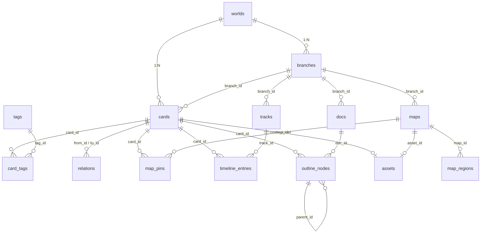

# WorldForge / 世界观工坊 —— 数据模型

| 项 | 内容 |
| --- | --- |
| 版本 | v0.1（`schemaVersion = 1`） |
| 日期 | 2026-02-14 |
| 数据库 | SQLite（sql.js WASM，内存态），DDL 定义于 `src/lib/db/schema.ts` |
| 表数量 | 17 张 = 业务表 14 张 + 支撑表 3 张（`assets` / `settings` / `plugins`） |
| 相关文档 | `docs/需求规格说明书-v0.1.md`、`docs/架构设计.md`、`docs/插件开发指南.md` |
## 1 约定

| 约定 | 说明 |
| --- | --- |
| 主键 | 全部 `TEXT` UUID（`crypto.randomUUID()`），便于 fork 复制与跨端导入免冲突 |
| 时间戳 | `created_at`/`updated_at` 为 Unix 毫秒（`INTEGER`）；`start_t`/`end_t`/`birth_t`/`death_t` 为**数值刻度**（`REAL`，可负可小数），非日期字符串（`docs/架构设计.md` §5.6） |
| JSON 列 | `meta`/`fields`/`resources`/`points`/`snapshot`/`settings` 存 JSON 文本；读 `JSON.parse`、写 `JSON.stringify`；未知键原样保留 |
| 布尔 | `INTEGER`，`0`/`1` |
| 外键 | v0.1 不启用 `PRAGMA foreign_keys`（sql.js 默认关闭），级联删除由 repo 层在事务内显式执行 |
| 命名 / 软删除 | 表名列名 `snake_case`（`docs/架构设计.md` §4.1）；不使用软删除，误删靠 `versions` 快照兜底 |
| 数据分层 | 结构数据 → 内存 SQLite；SQLite 快照二进制 → IndexedDB `kv` 键 `worldforge:db`；图片 Blob → IndexedDB `assets`；图片元数据 → 表 `assets` |
## 2 ER 图


| 表 | 关键列 | 用途 |
| --- | --- | --- |
| `worlds` | `name`, `meta` | 顶层容器；`meta` 存时间轴单位与纪元零点 |
| `branches` | `world_id`, `name`, `divergence_t`, `is_main` | 平行世界；`branch_id` 为全部业务表的隔离键 |
| `cards` | `world_id`, `branch_id`, `type`, `title`, `fields`, `cover_asset` | 统一卡片表，9 类 + 插件自定义类型 |
| `tags` / `card_tags` | `world_id`,`name` / `card_id`,`tag_id` | 自由标签与多对多关联 |
| `relations` | `from_id`, `to_id`, `label`, `directed` | 卡片关联；标签用户自由填写，双向反查 |
| `maps` / `map_pins` / `map_regions` | `asset_id`,`period` / `card_id`,`x`,`y` / `points`,`resources` | 多地图、归一化坐标标记、区划多边形与资源 |
| `tracks` / `timeline_entries` | `kind`,`order_index` / `start_t`,`end_t`,`instant`,`state` | 时间轴泳道与条目；年龄由 `birth_t` 推算 |
| `eras` | `start_t`, `end_t`, `color` | 纪元背景分段 |
| `docs` / `outline_nodes` | `kind`,`content` / `parent_id`,`status`,`card_id` | 文稿（Markdown + 双链）与大纲树三视图 |
| `versions` | `snapshot`, `size` | 整库 JSON 快照，用于对比与还原 |
| `assets` / `settings` / `plugins` | `mime` / `key`,`value` / `code`,`enabled` | 图片元数据、键值配置（含 `schemaVersion`）、插件 |
## 3 表定义

所有表均隐含 `id TEXT PRIMARY KEY`（`card_tags` 用复合主键除外）。类型简写：`T`=TEXT、`I`=INTEGER、`R`=REAL；`IDX`=已建索引，`FK`=逻辑外键（v0.1 不强制）。
### 3.1 `worlds` 世界观体系（顶层容器）

| 字段 | 类型 | 约束 | 说明 |
| --- | --- | --- | --- |
| `id` | T | PK | UUID |
| `name` | T | NOT NULL | 世界观名称 |
| `description` | T | NULL | 简介 |
| `meta` | T | NULL, JSON | 时间轴配置 `{tickUnit, tickZeroLabel, tickScale, defaultEraId, theme}` |
| `created_at` / `updated_at` | I | NOT NULL | Unix ms |
### 3.2 `branches` 平行世界 / 分支

| 字段 | 类型 | 约束 | 说明 |
| --- | --- | --- | --- |
| `id` | T | PK | UUID |
| `world_id` | T | NOT NULL, IDX | 所属世界 |
| `name` | T | NOT NULL | 分支名（「主线」「如果主角没死」） |
| `description` | T | NULL | 描述 |
| `color` | T | NULL | 分支标识色 HEX |
| `divergence` / `divergence_t` | T / R | NULL | 分歧说明（从哪一刻起不同）/ 分歧刻度 |
| `is_main` | I | DEFAULT 0 | 主世界标记（每世界仅一条为 1） |
| `meta` | T | NULL, JSON | 扩展字段 |
| `created_at` / `updated_at` | I | NOT NULL | Unix ms |
### 3.3 `cards` 统一卡片表

| 字段 | 类型 | 约束 | 说明 |
| --- | --- | --- | --- |
| `id` | T | PK | UUID |
| `world_id` | T | NOT NULL, IDX | 所属世界 |
| `branch_id` | T | NOT NULL, IDX | 隔离键（`docs/架构设计.md` §5.9） |
| `type` | T | NOT NULL | `character`角色 / `location`地点 / `event`事件 / `lore`底层逻辑 / `faction`势力 / `item`物品 / `concept`概念 / `reference`参考资料 / `note`随笔 + 插件自定义类型 |
| `title` | T | NOT NULL | 标题；`[[标题]]` 双链按此解析 |
| `subtitle` / `summary` | T | NULL | 副标题（称号、别名）/ 摘要（列表与悬浮预览） |
| `body` | T | NULL | 正文 Markdown，含 `[[双链]]` 与 `asset://<id>` 图片引用 |
| `fields` | T | NULL, JSON | 类型差异化字段（字典见 §4） |
| `cover_asset` | T | NULL, FK→`assets.id` | 封面图片 id |
| `pinned` / `order_index` | I | DEFAULT 0 | 置顶标记 / 手动排序位 |
| `meta` | T | NULL, JSON | `{color, icon, pluginType}` |
| `created_at` / `updated_at` | I | NOT NULL | Unix ms |

索引：`idx_cards_scope(world_id, branch_id, type)`、`idx_cards_title(world_id, title)`、`idx_cards_updated(world_id, branch_id, updated_at DESC)`。
### 3.4 `tags` 标签 / 3.5 `card_tags` 卡片↔标签

| 表 | 字段 | 类型 | 约束 | 说明 |
| --- | --- | --- | --- | --- |
| `tags` | `id` | T | PK | UUID |
| `tags` | `world_id` | T | NOT NULL, IDX | 按世界共享，不随分支隔离 |
| `tags` | `name` | T | NOT NULL | 标签名；`UNIQUE(world_id, name)` |
| `tags` | `color` / `description` | T | NULL | 徽标色 / 说明 |
| `tags` | `created_at` | I | NOT NULL | Unix ms |
| `card_tags` | `card_id` | T | PK(1), FK→`cards.id` | 卡片 |
| `card_tags` | `tag_id` | T | PK(2), FK→`tags.id` | 标签 |

`card_tags` 索引：`idx_card_tags_tag(tag_id)`（反查某标签下的全部卡片）。
### 3.6 `relations` 卡片关联

| 字段 | 类型 | 约束 | 说明 |
| --- | --- | --- | --- |
| `id` | T | PK | UUID |
| `world_id` | T | NOT NULL | 冗余列，反查时免 JOIN `cards` |
| `branch_id` | T | NOT NULL, IDX | 隔离键 |
| `from_id` / `to_id` | T | NOT NULL, IDX, FK→`cards.id` | 起点 / 终点卡片 |
| `label` | T | NOT NULL | **用户自由填写**（师徒/隶属/导致/参考自/参与…），无枚举约束 |
| `note` | T | NULL | 关系备注 |
| `directed` | I | DEFAULT 1 | 1=有向；0=无向（如「同乡」） |
| `created_at` / `updated_at` | I | NOT NULL | Unix ms |

约束：`CHECK (from_id <> to_id)`；索引 `idx_rel_from(from_id)`、`idx_rel_to(to_id)`、`idx_rel_label(world_id, label)`。
### 3.7 `maps` 地图（支持多张）

| 字段 | 类型 | 约束 | 说明 |
| --- | --- | --- | --- |
| `id` | T | PK | UUID |
| `world_id` / `branch_id` | T | NOT NULL, IDX | 世界与分支隔离键 |
| `name` / `description` | T | NOT NULL / NULL | 地图名（「北境·战前」）/ 描述 |
| `asset_id` | T | NULL, FK→`assets.id` | 底图（世界级共享，fork 不复制二进制） |
| `width` / `height` | I | NOT NULL DEFAULT 1000/700 | 底图原始像素尺寸，用于归一化换算 |
| `period` | T | NULL | 时期标识（「第三纪 500 年」），时期切换依据 |
| `era` | T | NULL | 对应 `eras.name` |
| `meta` | T | NULL, JSON | `{minZoom, maxZoom, bgColor}` |
| `created_at` / `updated_at` | I | NOT NULL | Unix ms |
### 3.8 `map_pins` 地图标记 / 3.9 `map_regions` 行政区划多边形

| 字段 | 类型 | 约束 | 说明 |
| --- | --- | --- | --- |
| `id` | T | PK | UUID |
| `map_id` | T | NOT NULL, IDX, FK→`maps.id` | 所属地图 |
| `card_id` | T | NULL, FK→`cards.id` | 绑定卡片（地点 / 势力…） |
| `x` / `y` | R | NOT NULL | 归一化坐标（0~1，相对底图宽高）——`map_pins` 专有 |
| `label` / `icon` / `color` | T | NULL | 标记文字（默认取卡片标题）/ 图标名 / 标记色 |
| `meta` | T | NULL, JSON | `{size, period, hidden}` |
| `name` / `color` | T | NOT NULL / NULL | 区划名 / 填充色（含透明度）——`map_regions` 专有 |
| `points` | T | NOT NULL, JSON | 归一化顶点数组 `[[x,y],[x,y],…]`（直线段，无贝塞尔） |
| `resources` | T | NULL, JSON | `{population, agriculture, mineral, tax, note}` |
| `period` | T | NULL | 该区划生效时期（与 `maps.period` 对齐） |
| `card_id` | T | NULL, FK→`cards.id` | 可选：关联「势力 / 地点」卡片 |
| `note` / `meta` | T | NULL | 备注 / `{opacity, hidden, order_index}` |
### 3.10 `tracks` 时间轴泳道

| 字段 | 类型 | 约束 | 说明 |
| --- | --- | --- | --- |
| `id` | T | PK | UUID |
| `world_id` / `branch_id` | T | NOT NULL, IDX | 世界与分支隔离键 |
| `name` | T | NOT NULL | 泳道名 |
| `kind` | T | NOT NULL | `event`事件 / `character`角色生命线 / `geo`地理变化 / `tech`科技水平 / `lore`底层设定 / `era`纪元 |
| `color` | T | NULL | 泳道色 |
| `order_index` / `visible` | I | DEFAULT 0 / 1 | 纵向顺序 / 是否显示 |
| `meta` | T | NULL, JSON | `{collapsed, height}` |

约束：`CHECK (kind IN ('event','character','geo','tech','lore','era'))`。
### 3.11 `timeline_entries` 时间轴条目

| 字段 | 类型 | 约束 | 说明 |
| --- | --- | --- | --- |
| `id` | T | PK | UUID |
| `world_id` / `branch_id` | T | NOT NULL, IDX | 世界与分支隔离键 |
| `track_id` | T | NOT NULL, IDX, FK→`tracks.id` | 所属泳道 |
| `card_id` | T | NULL, FK→`cards.id` | 关联卡片；角色泳道必填以推算年龄 |
| `title` | T | NOT NULL | 条目标题 |
| `start_t` | R | NOT NULL | 起始刻度（可为负） |
| `end_t` | R | NULL | 结束刻度；`instant=1` 时忽略 |
| `instant` | I | DEFAULT 0 | 1=瞬时点事件 |
| `note` / `state` | T | NULL | 说明 / 该区间内的身份状态（「学徒」「领主」） |
| `meta` | T | NULL, JSON | `{color, icon, laneOffset, source}` |

约束：`CHECK (instant = 1 OR end_t IS NULL OR end_t >= start_t)`；索引 `idx_te_track(track_id, start_t)`、`idx_te_card(card_id)`。
年龄推算：`age = t - fields.birth_t`；`t >= fields.death_t` 标记已故（`src/lib/timeline.ts` 的 `ageAt()`）。
### 3.12 `eras` 纪元分段

| 字段 | 类型 | 约束 | 说明 |
| --- | --- | --- | --- |
| `id` | T | PK | UUID |
| `world_id` | T | NOT NULL, IDX | 按世界共享，不随分支隔离 |
| `name` | T | NOT NULL | 纪元名（「第一纪」「大灾变后」） |
| `start_t` / `end_t` | R | NOT NULL | 起止刻度，可为负、可相邻不连续 |
| `color` / `note` | T | NULL | 时间轴背景色（建议低透明度）/ 说明 |
| `order_index` | I | DEFAULT 0 | 排序 |
### 3.13 `docs` 文稿

| 字段 | 类型 | 约束 | 说明 |
| --- | --- | --- | --- |
| `id` | T | PK | UUID |
| `world_id` / `branch_id` | T | NOT NULL, IDX | 世界与分支隔离键 |
| `kind` | T | NOT NULL | `manuscript`正文 / `outline`大纲 / `note`笔记 |
| `title` | T | NOT NULL | 文稿标题 |
| `content` | T | NULL | Markdown 正文，支持 `[[卡片标题]]` 与 `asset://<id>` |
| `summary` | T | NULL | 摘要 |
| `card_id` | T | NULL, FK→`cards.id` | 可选：与卡片（如 `lore`）双向绑定 |
| `order_index` / `word_count` | I | DEFAULT 0 | 排序 / 缓存字数（`src/lib/utils.ts` 计算） |
| `meta` | T | NULL, JSON | `{target, status, tags}` |
| `created_at` / `updated_at` | I | NOT NULL | Unix ms |

约束：`CHECK (kind IN ('manuscript','outline','note'))`。
### 3.14 `outline_nodes` 大纲树节点

| 字段 | 类型 | 约束 | 说明 |
| --- | --- | --- | --- |
| `id` | T | PK | UUID |
| `doc_id` | T | NOT NULL, IDX, FK→`docs.id` | 所属大纲文稿（`docs.kind='outline'`） |
| `parent_id` | T | NULL, FK→`outline_nodes.id` | 父节点（NULL 为根，支持无限层级） |
| `order_index` | I | DEFAULT 0 | 同级排序 |
| `title` / `summary` | T | NOT NULL / NULL | 节点标题 / 摘要要点 |
| `status` | T | DEFAULT 'idea' | `idea` / `draft` / `done` |
| `card_id` | T | NULL, FK→`cards.id` | 挂接的设定卡片 |
| `meta` | T | NULL, JSON | `{color, collapsed, wordTarget}` |

约束：`CHECK (status IN ('idea','draft','done'))`；索引 `idx_on_doc(doc_id, parent_id, order_index)`。
三视图（文本 / 树形 / 思维导图）读写同一份数据，视图切换不改变 `id` 与层级。
### 3.15 `versions` 设定版本快照

| 字段 | 类型 | 约束 | 说明 |
| --- | --- | --- | --- |
| `id` | T | PK | UUID |
| `world_id` | T | NOT NULL, IDX | 所属世界 |
| `name` / `note` | T | NOT NULL / NULL | 版本名（「开团前」）/ 备注 |
| `snapshot` | T | NOT NULL, JSON | 整库快照（结构见 §8），**不含图片二进制** |
| `size` | I | NOT NULL | 快照 UTF-8 字节数 |
| `schema_version` | I | NOT NULL DEFAULT 1 | 生成快照时的 `schemaVersion` |
| `created_at` | I | NOT NULL | Unix ms |
### 3.16 `assets` 图片元数据 / 3.17 `settings` 键值配置（支撑表）

| 表 | 字段 | 类型 | 约束 | 说明 |
| --- | --- | --- | --- | --- |
| `assets` | `id` | T | PK | UUID，同时是 IndexedDB `assets` 仓库的键 |
| `assets` | `world_id` | T | NULL, IDX | 所属世界（可空 = 世界无关素材） |
| `assets` | `name` / `mime` | T | NOT NULL | 原始文件名 / `image/png` 等 |
| `assets` | `width` / `height` / `size` | I | NULL | 像素尺寸与字节数 |
| `assets` | `hash` | T | NULL | 内容哈希，用于去重 |
| `assets` | `created_at` | I | NOT NULL | Unix ms |
| `assets` | `meta` | T | NULL, JSON | `{source, alt, compressed}` |
| `settings` | `key` | T | PK | 键名 |
| `settings` | `value` | T | NULL | 字符串或 JSON 文本 |
| `settings` | `updated_at` | I | NOT NULL | Unix ms |

`settings` 保留键：`schemaVersion`(=1)、`appVersion`、`activeWorldId`、`activeBranchId`、`ui.layout`、`ui.theme`、`savedFilters`、`plugin:<id>:<key>`（插件私有存储）。
### 3.18 `plugins` 插件（支撑表）

| 字段 | 类型 | 约束 | 说明 |
| --- | --- | --- | --- |
| `id` | T | PK | 插件 id（`name@author` 约定或 UUID） |
| `name` | T | NOT NULL | 插件名 |
| `version` / `author` / `description` | T | NULL | 元信息 |
| `code` | T | NULL | 单文件 ES 模块源码（内置插件可空，改由应用内 `import()` 提供） |
| `enabled` / `builtin` | I | DEFAULT 0 | 是否启用 / 是否内置（内置不可卸载，仅可禁用） |
| `settings` | T | NULL, JSON | 用户设置值（宿主按声明 schema 渲染表单写入） |
| `settings_schema` | T | NULL, JSON | 插件声明的设置表单结构 |
| `last_error` | T | NULL | 最近异常信息（用于提示与连续失败自动禁用） |
| `created_at` / `updated_at` | I | NOT NULL | Unix ms |

### 3.19 `card_assets` 卡片图库（v0.1 实现新增）

规格初稿里图片只记在 `cards.cover_asset`（单张封面），但需求 5 明确要求「能插入一些图片，比如角色形象、背景设定图等」——一张角色卡往往需要形象图 + 服装设定 + 场景概念图。因此 v0.1 实现新增一张显式关联表：

| 字段 | 类型 | 约束 | 说明 |
| --- | --- | --- | --- |
| `id` | T | PK | 关联行 id |
| `card_id` | T | NOT NULL, INDEX | 所属卡片 |
| `asset_id` | T | NOT NULL | 指向 `assets.id`（二进制在 IndexedDB `assets` 仓库） |
| `caption` | T | DEFAULT '' | 图注（预留，UI 暂未开放编辑） |
| `order_index` | I | DEFAULT 0 | 图库内排序 |

索引：`idx_card_assets_card(card_id)`。

语义约定：

- `cards.cover_asset` 仍是「列表与悬浮预览用的那一张」，取值必须同时存在于 `card_assets` 中；
- 取消封面 = 把 `cover_asset` 置空，不删除关联行；
- 从图库移除图片 = 删除 `card_assets` 行；是否同时删除 `assets` 行与 IndexedDB Blob 由用户二次确认（避免误删被其它卡片复用的图片）；
- 删除卡片时级联清理 `card_assets`（见 §6）。

> 版本快照 `versions.snapshot` **不含** `card_assets` 与 `assets`：图片二进制不参与版本对比，快照只记录卡片正文与结构化字段。还原快照时按 id 引用原资源，只要资源还在原处，图片就会继续显示。

## 4 卡片类型字段字典（`cards.fields`）

字段定义由 `src/features/plugins/registry.ts` 的类型注册表提供（表驱动渲染），插件可经 `registerCardField(type, field)` 追加。字段类型：`text` / `number` / `tick`（数值刻度）/ `select` / `link`（卡片引用，`link[]` 为多个）/ `longtext`。全部时间字段均为**数值刻度**。

| `type` | 键 | 类型 | 含义 / 用途 |
| --- | --- | --- | --- |
| `character` | `gender` / `race` / `title_alias` | text | 性别 / 种族（展示筛选）/ 称号别名（搜索、`[[双链]]` 候选） |
| `character` | `birth_t` / `death_t` | tick | 出生 / 死亡刻度（空=存活）：年龄推算、纪元定位、已故标记 |
| `character` | `affiliation` | link | 所属势力（→`faction`）：关联、筛选 |
| `character` | `appearance` / `personality` / `ability` | longtext | 外貌 / 性格 / 能力技能 |
| `location` | `terrain` | select | 地形（平原/山地/森林/沙漠/海岸/沼泽/极地/地下） |
| `location` | `climate` | select | 气候（寒带/温带/热带/干旱/极地） |
| `location` | `population` | number | 人口：地图区划资源、地理变化演进 |
| `location` | `agriculture` / `mineral` | text | 农业产出 / 矿产：资源对比 |
| `location` | `area_km2` | number | 面积（自定义单位）：展示、排序 |
| `location` | `parent_location` | link | 上级地点：层级组织 |
| `location` | `government` / `coordinates` | text | 政体 / 自定义坐标描述 |
| `event` | `start_t` / `end_t` | tick | 起止刻度：时间轴同步、时长计算 |
| `event` | `instant` | select | 是否瞬时（yes/no）：时间轴渲染形态 |
| `event` | `scale` | select | 规模（个人/局部/区域/世界/宇宙） |
| `event` | `outcome` / `location` | longtext / link | 结果与影响 / 发生地点 |
| `event` | `participants` | link[] | 参与者（→`character`/`faction`）：生成 `relations(label='参与')` |
| `lore` | `category` | select | 分类（自然法则/魔法体系/宗教信仰/社会制度/历史真相/技术原理） |
| `lore` | `scope` | select | 作用范围（全球/区域/个体/例外） |
| `lore` | `impact` | number | 影响强度（0~10 自定标度） |
| `lore` | `constraints` | longtext | 限制与代价（能做什么、不能做什么）——写作区重点 |
| `lore` | `exceptions` / `established_t` | longtext / tick | 例外条款 / 生效起始刻度（时间轴 `lore` 泳道） |
| `reference` | `source_type` | select | 来源类型（书籍/网页/论文/视频/访谈/其他） |
| `reference` | `author` / `publisher` / `page` | text | 作者机构 / 出版方 / 页码章节 |
| `reference` | `url` | text | 链接（仅 `http`/`https`）：外部浏览器打开 |
| `reference` | `year` | number | 现实年份（非故事刻度）：排序 |
| `reference` | `excerpt` / `license` | longtext / text | 摘录原文 / 版权许可说明 |
| `faction` | `leader` | link | 领袖（→`character`） |
| `faction` | `scale` | select | 规模（家族/城邦/王国/帝国/秘密结社） |
| `faction` | `founded_t` / `dissolved_t` | tick | 成立 / 解体刻度：时间轴 |
| `faction` | `territory` | link | 领地（→`location` / `map_regions`）：地图区划绑定 |
| `faction` | `ideology` / `strength` | longtext / number | 理念教义 / 实力评分 |
| `item` | `rarity` | select | 稀有度（普通/稀有/史诗/传说/唯一） |
| `item` | `origin` / `owner` | link | 来源 / 当前持有者 |
| `item` | `created_t` | tick | 制造刻度：时间轴 |
| `item` | `effect` / `material` | longtext / text | 效果能力 / 材质 |
| `concept` | `concept_type` | select | 概念类型（哲学/术语/称谓/单位） |
| `concept` | `definition` / `related` | longtext / link[] | 定义 / 相关概念（自动生成关联） |
| `note` | `mood` / `source_ref` | select / link | 情绪标记（灵感/待办/疑问）/ 关联参考资料 |
> 插件注册的自定义类型使用自己的字段定义；未在定义表中的键在 UI 中不渲染，但**数据保留**（前向兼容）。
## 5 典型查询示例
### 5.1 按标签筛选卡片（AND / OR）
```sql
-- AND：同时带「主角团」与「已死亡」标签的角色卡片（当前分支）
SELECT c.id, c.title, c.type FROM cards c
JOIN card_tags ct ON ct.card_id = c.id
JOIN tags t       ON t.id = ct.tag_id
WHERE c.world_id = :world AND c.branch_id = :branch
  AND c.type = 'character' AND t.name IN ('主角团', '已死亡')
GROUP BY c.id
HAVING COUNT(DISTINCT t.name) = 2
ORDER BY c.updated_at DESC;

-- OR：命中任一标签并去重（改为 SELECT DISTINCT 并删去 HAVING 行即可）
```
### 5.2 卡片关联双向反查（含双链反查）
```sql
SELECT r.id, r.label, r.directed, r.note, 'out' AS dir, rc.title AS other_title, rc.type AS other_type
FROM relations r JOIN cards rc ON rc.id = r.to_id  WHERE r.from_id = :cardId
UNION ALL
SELECT r.id, r.label, r.directed, r.note, 'in'  AS dir, rc.title AS other_title, rc.type AS other_type
FROM relations r JOIN cards rc ON rc.id = r.from_id WHERE r.to_id = :cardId
ORDER BY label, dir;

-- 文稿双链反查：哪些文稿引用了某卡片标题
SELECT d.id, d.title, d.kind FROM docs d
WHERE d.world_id = :world AND d.branch_id = :branch
  AND d.content LIKE '%[[' || :cardTitle || ']]%';
```
### 5.3 取某时间点某角色的年龄与状态
```sql
SELECT c.title,
       :t - CAST(json_extract(c.fields, '$.birth_t') AS REAL) AS age_at_t,
       (json_extract(c.fields, '$.death_t') IS NOT NULL
        AND :t >= CAST(json_extract(c.fields, '$.death_t') AS REAL)) AS dead,
       te.title AS entry_title, te.state AS state_at_t
FROM cards c
LEFT JOIN timeline_entries te
       ON te.card_id = c.id AND te.start_t <= :t
      AND (te.instant = 1 OR te.end_t IS NULL OR te.end_t >= :t)
WHERE c.id = :cardId;
```

> sql.js 编译包含 JSON1 扩展，`json_extract` 可用；若目标构建不含 JSON1，退化为 repo 层 `JSON.parse` 后调用 `src/lib/timeline.ts` 的 `ageAt()`。
### 5.4 某地图某时期的区域资源汇总
```sql
SELECT r.name,
       json_extract(r.resources, '$.population')  AS population,
       json_extract(r.resources, '$.agriculture') AS agriculture,
       json_extract(r.resources, '$.mineral')     AS mineral
FROM map_regions r
WHERE r.map_id = :mapId AND (r.period IS NULL OR r.period = :period)
ORDER BY population DESC;

-- 汇总：COUNT(*) AS regions, SUM(CAST(json_extract(r.resources,'$.population') AS INTEGER)) AS total_population
```
### 5.5 地图标记及其绑定卡片
```sql
SELECT p.id, p.x, p.y, p.label, p.icon, p.color, c.id AS card_id, c.title, c.type
FROM map_pins p LEFT JOIN cards c ON c.id = p.card_id
WHERE p.map_id = :mapId ORDER BY p.y, p.x;
```
### 5.6 时间轴窗口内条目（含角色起始年龄）
```sql
SELECT te.id, te.title, te.start_t, te.end_t, te.instant, te.state,
       t.name AS track_name, t.kind, c.title AS card_title,
       CASE WHEN json_extract(c.fields, '$.birth_t') IS NOT NULL
            THEN te.start_t - CAST(json_extract(c.fields, '$.birth_t') AS REAL)
            ELSE NULL END AS age_at_start
FROM timeline_entries te
JOIN tracks t     ON t.id = te.track_id
LEFT JOIN cards c ON c.id = te.card_id
WHERE te.branch_id = :branch AND t.visible = 1
  AND (te.instant = 1 OR te.end_t >= :tMin) AND te.start_t <= :tMax
ORDER BY t.order_index, te.start_t;
```
### 5.7 版本快照的生成与还原
```sql
-- 生成：逐表序列化为 JSON 后写入（分片执行以让出主线程）
INSERT INTO versions (id, world_id, name, note, snapshot, size, schema_version, created_at)
VALUES (:id, :world, :name, :note, :snapshotJson, :size, 1, :now);

-- 读取用于对比
SELECT snapshot, schema_version, created_at FROM versions WHERE id = :versionId;

-- 还原：单事务内按表清空，随后由 repo 层参数化逐行写回快照内容
BEGIN;
DELETE FROM card_tags WHERE card_id IN (SELECT id FROM cards WHERE world_id = :world);
DELETE FROM relations WHERE world_id = :world;
DELETE FROM cards     WHERE world_id = :world;
COMMIT;
```
### 5.8 未引用图片扫描（清理用）
```sql
SELECT a.id, a.name, a.size FROM assets a
WHERE NOT EXISTS (SELECT 1 FROM cards c WHERE c.cover_asset = a.id)
  AND NOT EXISTS (SELECT 1 FROM maps  m WHERE m.asset_id    = a.id)
  AND NOT EXISTS (SELECT 1 FROM cards c WHERE c.body LIKE '%asset://' || a.id || '%');
```
## 6 事务与一致性

| 场景 | 事务边界 |
| --- | --- |
| 保存卡片 + 标签 + 关联 | 单事务：`cards` upsert → `card_tags` 差量更新 → `relations` 增删 |
| 删除卡片 | 单事务：删 `card_tags` 与相关 `relations`；`map_pins.card_id`、`timeline_entries.card_id`、`outline_nodes.card_id` 置空；最后删 `cards` |
| fork 分支 | 单事务按表顺序复制并重写 id 映射；超 5000 行分批提交，失败时按已写入的 `branch_id` 清理 |
| 还原版本 | 单事务清空 + 插入；失败立即 `ROLLBACK`，当前数据保持不变 |
| 导入 JSON | 先 `flush()` → 生成「导入前自动快照」→ 单事务写入 → 重建内存与反查索引 |

### 6.1 事务必须可重入（v0.1 实现要点）

仓储层为了「一次调用即原子」，`saveMany` / `purgeXxx` 内部都会自己开事务。于是像 `restoreSnapshot` 这种「清空 + 批量写回」的复合操作会出现**事务嵌套**，直接 `BEGIN` 会抛 SQLite 的 `cannot start a transaction within a transaction`。

`src/lib/db/sqlite.ts` 的 `tx()` 因此用**深度计数**实现可重入：

```ts
let txDepth = 0;
export function tx<T>(fn: () => T): T {
  const database = getDb();
  if (txDepth > 0) return fn();   // 内层：复用外层事务，不重复 BEGIN
  database.run('BEGIN');
  txDepth += 1;
  try {
    const result = fn();
    database.run('COMMIT');
    markDirty();
    return result;
  } catch (err) {
    database.run('ROLLBACK');
    throw err;
  } finally {
    txDepth -= 1;
  }
}
```

`restoreSnapshot()` 也据此把「清空」与「写回」放进**同一个** `tx()`，保证不会出现「清空了但没写回」的半成品状态（该问题由 `scripts/db-selftest.mjs` 的版本还原用例捕获并回归）。

### 6.2 列名即属性名（必须逐字一致）

通用仓储（`src/lib/db/table.ts`）的 `TableSpec.columns` 承担**两个角色**：既是 SQL 列名，又是领域对象上的属性名 —— `decodeRow` 用 `out[col] = …` 写回、`saveRow` 用 `obj[col]` 取值。因此领域类型的字段名必须与列名逐字相同。

| 写错的后果 | 说明 |
| --- | --- |
| 读：属性是 `undefined` | `decodeRow` 产出的是列名那个键，类型声明的名字根本不存在 |
| 写：字段被静默丢弃 | `obj[col]` 取到 `undefined`，被当作空值写回（JSON 列落回默认值） |
| 为何难查 | **typecheck 通过、构建通过、单元测试通过**，直到某处对 `undefined` 取值才在离现场很远的地方崩 |

真实案例：`plugins` 表的列名是 `settings_schema`，而 `PluginRecord` 曾把它写成驼峰 `settingsSchema`。结果是插件详情页 `Object.keys(plugin.settings_schema)` 抛 `TypeError: Cannot convert undefined or null to object`，「插件」模块整个白屏。

防护：`scripts/selftest-specs.mjs` 用 TypeScript 编译器取出每个 `createRepo<T>(X_SPEC)` 的类型属性名，与 `['id', ...columns]` 强制比对（含 `extends` 继承展开），任何不一致都会让 `npm test` 失败。

```ts
// ❌ plugins 表：驼峰与列名不符
settingsSchema: Record<string, PluginSettingDef>;
// ✅ 与 DDL 中的 settings_schema 一致
settings_schema: Record<string, PluginSettingDef>;
```

## 7 迁移与兼容策略

| 项 | 规则 |
| --- | --- |
| 版本记录 | `settings` 键 `schemaVersion`；v0.1 值为 `1`；代码常量 `SCHEMA_VERSION = 1` |
| 启动检查 | 读快照 → 比对 `settings.schemaVersion` 与代码常量 → 低则顺序迁移；高则拒绝启动并提示升级应用 |
| 迁移脚本 | `src/lib/db/migrations/v1_to_v2.ts` 导出 `up(db)`；迁移前把原快照备份到 `kv` 的 `db:backup:<旧版本>` |
| 加列 | `ALTER TABLE … ADD COLUMN`；新增列必须可空或带默认值 |
| 删列 / 改类型 | 「新建表 → 复制 → 改名」四步法，全程单事务 |
| JSON 列演进 | `fields`/`meta`/`resources` 新增键无需迁移；缺失视为未设置，写入新键不动旧键 |
| 表新增 | 迁移脚本 `CREATE TABLE IF NOT EXISTS` + 索引；老快照读入后自动补建 |
| 快照兼容 | 快照与导出 JSON 均带 `schemaVersion`；导入低版本走迁移，高版本拒绝并显示版本号 |
| 插件数据 | `plugin:<id>:*` 前缀的 `settings` 键在卸载插件时由用户决定是否清除 |
## 8 导入 / 导出 JSON 结构
### 8.1 整库导出（`format: "worldforge-export"`）
```json
{
  "format": "worldforge-export",
  "schemaVersion": 1,
  "appVersion": "0.1.0",
  "exportedAt": 1770000000000,
  "scope": { "worldId": "w-1", "branchId": "b-main", "includeAssets": false },
  "data": {
    "worlds": [ { "id": "w-1", "name": "灰烬纪", "description": "…", "meta": { "tickUnit": "年", "tickZeroLabel": "创世", "tickScale": 1 }, "created_at": 1, "updated_at": 2 } ],
    "branches": [ { "id": "b-main", "world_id": "w-1", "name": "主线", "description": "", "color": "#7c3aed", "divergence": null, "divergence_t": null, "is_main": 1 } ],
    "cards": [ { "id": "c-1", "world_id": "w-1", "branch_id": "b-main", "type": "character", "title": "凯尔", "subtitle": "灰烬骑士", "summary": "…", "body": "## 生平\n[[北境]]出身。\n\n", "fields": { "birth_t": 512, "death_t": null, "gender": "男", "affiliation": "c-9" }, "cover_asset": "a-1", "pinned": 0, "order_index": 0, "meta": {} } ],
    "tags": [ { "id": "t-1", "world_id": "w-1", "name": "主角团", "color": "#22c55e" } ],
    "card_tags": [ { "card_id": "c-1", "tag_id": "t-1" } ],
    "relations": [ { "id": "r-1", "world_id": "w-1", "branch_id": "b-main", "from_id": "c-1", "to_id": "c-9", "label": "隶属", "note": "", "directed": 1 } ],
    "maps": [ { "id": "m-1", "world_id": "w-1", "branch_id": "b-main", "name": "北境·战前", "asset_id": "a-2", "width": 1600, "height": 1000, "period": "第三纪 500 年", "era": "第三纪" } ],
    "map_pins": [ { "id": "p-1", "map_id": "m-1", "card_id": "c-2", "x": 0.42, "y": 0.31, "label": "冰港", "icon": "castle", "color": "#38bdf8" } ],
    "map_regions": [ { "id": "g-1", "map_id": "m-1", "name": "北境", "color": "#38bdf855", "points": [[0.1,0.1],[0.5,0.08],[0.55,0.4],[0.15,0.45]], "resources": { "population": 120000, "agriculture": "耐寒麦", "mineral": "铁矿" }, "period": "第三纪 500 年" } ],
    "tracks": [ { "id": "k-1", "world_id": "w-1", "branch_id": "b-main", "name": "主线事件", "kind": "event", "color": "#f97316", "order_index": 0, "visible": 1 } ],
    "timeline_entries": [ { "id": "e-1", "world_id": "w-1", "branch_id": "b-main", "track_id": "k-1", "card_id": "c-1", "title": "灰烬之战", "start_t": 530, "end_t": 533, "instant": 0, "state": "骑士", "note": "…" } ],
    "eras": [ { "id": "er-1", "world_id": "w-1", "name": "第三纪", "start_t": 400, "end_t": 700, "color": "#a78bfa22" } ],
    "docs": [ { "id": "d-1", "world_id": "w-1", "branch_id": "b-main", "kind": "manuscript", "title": "第一章", "content": "…[[凯尔]]…", "word_count": 3200, "order_index": 0 } ],
    "outline_nodes": [ { "id": "o-1", "doc_id": "d-2", "parent_id": null, "order_index": 0, "title": "第一幕", "summary": "…", "status": "draft", "card_id": "c-1" } ],
    "versions": [ { "id": "v-1", "world_id": "w-1", "name": "开团前", "note": "…", "snapshot": "{…}", "size": 184320, "schema_version": 1, "created_at": 1770000000000 } ],
    "assets": [ { "id": "a-1", "world_id": "w-1", "name": "kyle.png", "mime": "image/png", "width": 800, "height": 1200, "size": 240123 } ],
    "settings": [ { "key": "ui.theme", "value": "dark" } ],
    "plugins": [ { "id": "theme.nord", "name": "Nord 主题", "version": "1.0.0", "author": "builtin", "description": "…", "code": "", "enabled": 1, "builtin": 1, "settings": { "accent": "#88c0d0" } } ]
  },
  "assets": null
}
```
### 8.2 含图片导出（`scope.includeAssets: true`）
```json
{
  "format": "worldforge-export",
  "schemaVersion": 1,
  "scope": { "worldId": "w-1", "branchId": "b-main", "includeAssets": true },
  "assets": [ { "id": "a-1", "mime": "image/png", "data": "iVBORw0KGgoAAAANSUhEUg…" } ],
  "data": { "（表结构与 8.1 完全一致，仅 assets 数组非空）": [] }
}
```

| 规则 | 说明 |
| --- | --- |
| `assets[].data` | base64 图片二进制；导入时解码写入 IndexedDB `assets` 仓库 |
| 体积提示 | 导出前提示预计体积（base64 使体积增大约 33%） |
| 冲突处理 | 按 `id` 判断：已存在则跳过（保留本地），不存在则写入；可切换为「全部覆盖」 |
| 部分导出 | `scope.worldId` + `scope.branchId` 支持单分支导出；`branches`/`tags`/`eras` 仍带出世界级定义 |
| 校验 | 校验 `format` 匹配、`schemaVersion <= SCHEMA_VERSION`、必需表键齐全 |
| 备份 | 导入前自动生成 `versions` 中的「导入前自动快照」 |
| Markdown 兜底 | 设置中提供「导出为 Markdown 文件夹（zip）」：卡片一文件、文稿一文件、大纲一文件、关联以链接列出 |
## 9 数据量与容量参考

| 数据 | v0.1 目标容量 | 估算体积 |
| --- | --- | --- |
| 卡片 | 1000 张（正文各 2 KB） | ≈ 2.5 MB |
| 关联 | 3000 条 | ≈ 0.4 MB |
| 时间轴条目 | 2000 条 | ≈ 0.4 MB |
| 文稿 | 300 篇（各 5 KB） | ≈ 1.5 MB |
| SQLite 快照合计 | — | ≈ 5 MB（gzip 后约 1 MB 量级） |
| 图片 | 200 张（压缩后各 ≈ 300 KB） | ≈ 60 MB（IndexedDB，不入快照） |
| 版本快照 | 20 个 | ≈ 100 MB（提示清理；v0.2 评估增量快照） |
