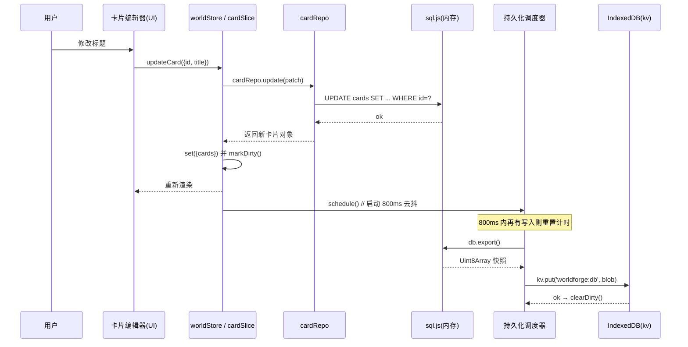
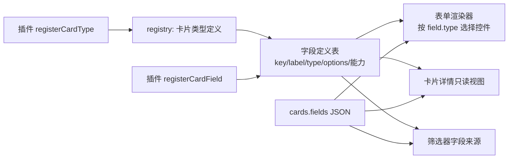
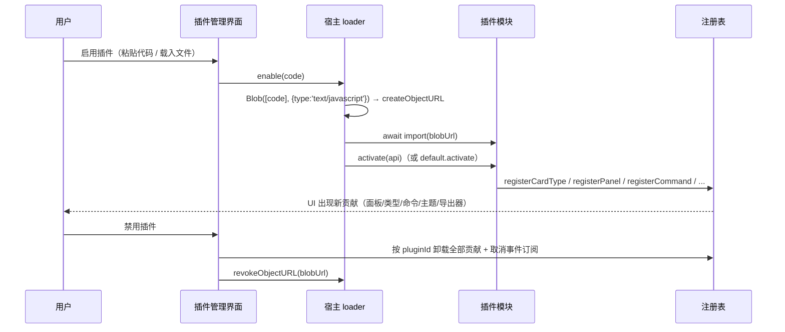
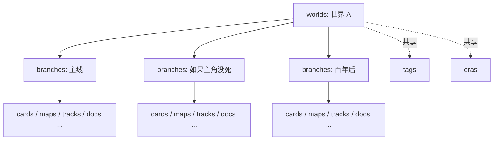

# WorldForge / 世界观工坊 —— 架构设计
| 项 | 内容 |
| --- | --- |
| 版本 | v0.1 |
| 日期 | 2026-02-14 |
| 适用范围 | v0.1 全部代码（`src/`、`src-tauri/`、`public/`） |
| 相关文档 | `docs/需求规格说明书-v0.1.md`、`docs/数据模型.md`、`docs/插件开发指南.md` |

---
## 1 架构总览
### 1.1 分层架构图
```text
┌───────────────────────────────────────────────────────────────────────────┐
│ ① UI 层  src/components/**  src/features/**                               │
│   shadcn/ui(Radix) 基础组件 · layout 应用骨架 · cards/map/timeline/...     │
│   只做「渲染 + 事件上抛」，不含 SQL、不含持久化逻辑                          │
└───────────────▲───────────────────────────────────────────┬───────────────┘
                │ 订阅 selector（细粒度）                     │ dispatch action
┌───────────────┴───────────────────────────────────────────▼───────────────┐
│ ② 状态层  src/store/**（zustand slices）                                   │
│   worldSlice · cardSlice · mapSlice · timelineSlice · docSlice ·          │
│   uiSlice · pluginSlice                                                   │
│   持有内存态镜像；写操作 → 调 repo → 成功后更新 state → 置脏标记            │
└───────────────▲───────────────────────────────────────────┬───────────────┘
                │ 返回领域对象（types/）                      │ repo 调用
┌───────────────┴───────────────────────────────────────────▼───────────────┐
│ ③ 仓储层  src/lib/db/repo/**                                              │
│   cardRepo · relationRepo · tagRepo · mapRepo · timelineRepo · docRepo ·  │
│   versionRepo · assetRepo · settingRepo · pluginRepo                      │
│   唯一允许拼 SQL 的地方；输入输出均为 src/types/ 的强类型对象               │
└───────────────▲───────────────────────────────────────────┬───────────────┘
                │ 结果集 → 对象映射                           │ SQL
┌───────────────┴───────────────────────────────────────────▼───────────────┐
│ ④ 存储层                                                                  │
│   ┌──────────────────────┐  export()   ┌───────────────────────────────┐  │
│   │ sql.js（内存 SQLite） │ ──────────► │ IndexedDB 仓库 kv             │  │
│   │ 17 张表，全部结构化数据│ ◄────────── │ 存 SQLite 导出快照（二进制）  │  │
│   └──────────────────────┘  快照二进制  ├───────────────────────────────┤  │
│                                        │ IndexedDB 仓库 assets         │  │
│                                        │ 存图片 Blob（二进制不入 SQLite）│  │
│                                        └───────────────────────────────┘  │
└───────────────▲───────────────────────────────────────────────────────────┘
                │ WASM / IDB / 文件系统
┌───────────────┴───────────────────────────────────────────────────────────┐
│ ⑤ 运行时与分发                                                            │
│   Tauri 2.0（仅 Windows 桌面；WebView2，打包 MSI / NSIS）                  │
│   PWA（Android、iOS、HarmonyOS；manifest + service worker）                │
│   静态站点：Vite 6 构建产物，可离线                                        │
└───────────────────────────────────────────────────────────────────────────┘
```
### 1.2 依赖方向规则
| 规则 | 说明 |
| --- | --- |
| 只向下依赖 | UI → store → repo → 存储；禁止反向 import（repo 不得 import store） |
| 类型集中 | 领域类型只在 `src/types/` 定义；其他层 import 类型而非重复声明 |
| SQL 集中 | 只有 `src/lib/db/repo/**` 允许出现 SQL 字符串；UI 与 store 不得拼 SQL |
| 无跨层捷径 | UI 不得直接调用 `src/lib/db/sqlite.ts`，必须经 store + repo |
| 插件边界 | 插件只能使用 `PluginAPI`（见 `docs/插件开发指南.md` §4），不得 import 内部模块 |
### 1.3 一次写操作的完整链路（时序）


---
## 2 目录结构
```text
worldforge/
├─ public/                     # PWA 与静态资源
│  ├─ manifest.webmanifest     # 应用名/图标/显示模式，满足可安装条件
│  ├─ sw.js                    # service worker：静态资源缓存与离线兜底
│  └─ icons/                   # 各尺寸应用图标
├─ src/
│  ├─ types/                   # 领域类型：表行类型、字段字典、API 契约（纯类型，无运行时代码）
│  ├─ lib/
│  │  ├─ db/                   # 数据访问层（唯一允许 SQL 的位置）
│  │  │  ├─ schema.ts          # 17 张表的建表 DDL 与索引定义
│  │  │  ├─ sqlite.ts          # initSqlJs 载入 wasm、内存库创建、DDL 执行
│  │  │  ├─ idb.ts             # IndexedDB 打开/升级，kv 与 assets 两个对象仓库
│  │  │  ├─ repo/              # 通用仓储：cardRepo/relationRepo/tagRepo/mapRepo/...
│  │  │  └─ snapshot.ts        # 整库导出/导入 JSON，schemaVersion 校验
│  │  ├─ markdown/             # 自研 Markdown 渲染器（子集语法，无第三方解析器）
│  │  ├─ wiki-link.ts          # [[卡片标题]] 解析、补全候选、反链索引
│  │  ├─ diff.ts               # LCS 行级 diff + 字段级 diff
│  │  ├─ timeline.ts           # 刻度换算、年龄推算、区间重叠判定
│  │  └─ utils.ts              # id 生成、去抖、深拷贝、格式化等纯函数
│  ├─ store/                   # zustand slices（内存态镜像 + action）
│  ├─ components/
│  │  ├─ ui/                   # shadcn 风格基础组件（Button/Dialog/Select/Popover/...）
│  │  └─ layout/               # 应用骨架：AppShell/Sidebar/TopBar/ViewSwitcher/CommandPalette
│  ├─ features/                # 业务模块（每个模块自带组件与局部逻辑）
│  │  ├─ cards/                # 卡片列表、详情、类型化字段表单、关联编辑
│  │  ├─ map/                  # 地图画布、标记、区划、时期切换
│  │  ├─ timeline/             # 泳道、刻度、条目、纪元色带
│  │  ├─ writer/               # Markdown 写作区、双链、预览、专注模式
│  │  ├─ outline/              # 大纲树、文本视图、思维导图视图
│  │  ├─ versions/             # 快照列表、对比报告、还原
│  │  ├─ plugins/              # 插件管理、宿主 API 实现、内置插件、注册表
│  │  └─ settings/             # 世界观/分支/标签/主题/布局/导入导出
│  ├─ App.tsx                  # 根组件：初始化、路由、布局装配
│  └─ main.tsx                 # 入口：挂载 React、注册生命周期钩子
├─ src-tauri/                  # Tauri 2.0 壳：窗口配置、权限能力、打包脚本
├─ index.html
├─ vite.config.ts              # 别名、manualChunks、PWA 插件、构建预算校验
├─ tailwind.config.js
├─ tsconfig.json
└─ package.json
```
| 目录 | 一句话职责 |
| --- | --- |
| `public/` | PWA 三件套与图标，构建时原样拷贝 |
| `src/types/` | 领域类型与表行类型，全局唯一的类型来源 |
| `src/lib/db/` | SQLite/IndexedDB 全部细节：DDL、初始化、仓储、快照 |
| `src/lib/` | 与存储无关的纯逻辑：Markdown、双链、diff、时间刻度、工具 |
| `src/store/` | zustand slices，连接 UI 与 repo 的唯一状态中枢 |
| `src/components/ui/` | 无业务语义的基础控件（shadcn 风格，源码复制而非依赖包） |
| `src/components/layout/` | 应用骨架与全局交互（侧栏、顶栏、视图切换、命令面板） |
| `src/features/*` | 按业务域切分的功能模块，模块之间不互相 import 内部文件 |
| `src-tauri/` | 桌面壳配置与打包（Windows MSI / NSIS），不含业务逻辑 |

---
## 3 技术选型与理由
| 技术 | 版本 | 选型理由 | 替代方案与否决原因 |
| --- | --- | --- | --- |
| React | 18 | 生态成熟、并发渲染、团队熟悉度 | Vue/Svelte：Radix 与 shadcn 生态不匹配 |
| Vite | 6 | 构建快、HMR 快、对 ESM/WASM 友好 | Webpack：构建慢，违背 FR-14 构建速度目标 |
| TypeScript | 5 | 表结构 ↔ 类型一致性，重构安全 | 纯 JS：17 张表的字段极易写错 |
| Tailwind CSS | 3 | 无运行时、产物可 purge、样式与组件同文件 | CSS-in-JS：运行时开销与产物体积 |
| shadcn/ui (Radix) | 最新 | 复制源码进仓库，零额外依赖、可访问性由 Radix 保证 | MUI/AntD：体积大、样式定制成本高 |
| sql.js | 1.10+ | SQLite 语义完整（JOIN/索引/事务），无需后端 | Dexie 直用 IDB：复杂反查与聚合难写；SQLite 也便于导出与迁移 |
| IndexedDB | 原生 | 浏览器端唯一的二进制大对象持久化方案 | localStorage：容量与二进制支持不足 |
| zustand | 5 | 体积极小、无 Provider 嵌套、selector 细粒度订阅 | Redux Toolkit：样板与体积；Context：全局重渲染 |
| Tauri 2.0 | 2.x | 安装包小（非 Electron）、仅桌面端打包（MSI / NSIS）、可访问文件系统 | Electron：安装包 80MB+，违背「小巧」定位 |
| PWA | 原生 | 覆盖 Android / iOS / HarmonyOS 等以 PWA / 浏览器安装承载的平台，零分发成本 | 原生多端：v0.1 成本不可控 |

---
## 4 代码规范
### 4.1 文件与命名
| 项 | 约定 | 示例 |
| --- | --- | --- |
| 单文件行数 | **不超过 200 行**（含注释与空行）；超限必须拆分 | 超出时按「一个机制一个文件」拆 |
| 注释 | 每个导出函数有块注释（做什么/参数/返回）；关键算法（diff、LCS、年龄推算、去抖）逐段说明「为什么」 | — |
| 组件文件 | PascalCase，一个文件一个主组件 | `CardDetailPanel.tsx` |
| 逻辑文件 | camelCase | `wiki-link.ts`、`timeline.ts` |
| 类型文件 | 按域拆分，文件名小写 | `card.ts`、`timeline.ts` |
| 表名 / 列名 | `snake_case`，与 `docs/数据模型.md` 完全一致 | `timeline_entries.start_t` |
| TS 变量 / 函数 | `camelCase`；类型与接口 `PascalCase` | `startT` ↔ `start_t` 的映射在 repo 内完成 |
| 常量 | `UPPER_SNAKE_CASE`，集中在文件顶部 | `SAVE_DEBOUNCE_MS = 800` |
### 4.2 编码纪律
| 编号 | 规则 |
| --- | --- |
| C-01 | 所有 SQL 参数化（`?` 占位），禁止字符串拼接用户输入 |
| C-02 | repo 层负责 `snake_case` ↔ `camelCase` 转换，UI 只见 camelCase |
| C-03 | 任何 `db.export()` 之外的耗时操作不得同步阻塞输入事件（超 16ms 的遍历需分片或移入 `requestIdleCallback`） |
| C-04 | 对象 URL 必须在 `useEffect` 清理函数中 `revokeObjectURL` |
| C-05 | 组件不得直接访问 `window.indexedDB` 或 sql.js 实例 |
| C-06 | 新增依赖必须更新 §6.4 白名单并说明体积增量 |
| C-07 | 可视化一律自研 SVG/Canvas 轻量实现，不引入通用图表库 |
### 4.3 单文件 ≤200 行的落地方式
| 场景 | 拆分方式 |
| --- | --- |
| 大表单 | 字段定义（数据）与渲染（组件）分离：字段定义进 `src/types/`，渲染进 `features/cards/fields/` |
| 大地图画布 | 拆为 `MapCanvas`（坐标与视图变换）/ `MapPins`（标记层）/ `MapRegions`（区划层）/ `useMapView`（hook） |
| 时间轴 | 拆为 `TimelineAxis`（刻度与缩放）/ `TimelineTrack`（泳道）/ `TimelineEntry`（条目）/ `useTimelineScale` |
| repo | 一个表族一个文件；跨表事务写在 `*.tx.ts` 中以保持单文件精简 |
### 4.4 禁止引入的重量级依赖
| 禁止项 | 体积 / 影响 | 替代方案 |
| --- | --- | --- |
| ProseMirror / TipTap / Slate 等富文本编辑器 | 200 KB ~ 500 KB，且需要大量扩展包 | 自研 `src/lib/markdown/` 子集渲染器 + `textarea` 源码编辑 |
| ECharts / Chart.js / D3 全量 | 150 KB ~ 1 MB | 自研 SVG 坐标轴与柱/线绘制；多边形用 `<polygon>` |
| MUI / Ant Design / Chakra 等 UI 框架 | 300 KB+，主题定制成本高 | shadcn/ui 源码 + Radix 原语 + Tailwind |
| moment.js | 体积大且不可 tree-shake | 原生 `Intl` 或 `date-fns`（按需 import） |
| lodash 全量 | 70 KB+ | 自写 `src/lib/utils.ts` 所需函数（去抖、深拷贝、分组） |
| Redux + RTK | 样板与体积 | zustand slices |

---
## 5 关键机制
### 5.1 启动与持久化时序
```mermaid
flowchart TD
    A[main.tsx 挂载] --> B[渲染 AppShell 骨架 + 加载指示]
    B --> C[initSqlJs 载入 sql-wasm.wasm]
    C --> D[打开 IndexedDB: kv / assets]
    D --> E{kv 中存在快照?}
    E -- 是 --> F[读出 Uint8Array → new SQL.Database(bytes)]
    E -- 否 --> G[new SQL.Database 空库 → 执行 schema.ts 的建表 DDL]
    F --> H[读取 settings.schemaVersion 并校验/迁移]
    G --> I[写入初始 settings 与默认世界观/分支]
    H --> J[repo 批量查询：worlds/branches/cards/tags/...]
    I --> J
    J --> K[注入 zustand store，构建关联反查索引]
    K --> L[app:ready → 触发插件 activate 与内置插件注册]
    L --> M[首屏可交互，标记 clean]
```
| 阶段 | 关键点 |
| --- | --- |
| wasm 载入 | `locateFile` 指向本地 `sql-wasm.wasm`，不走 CDN（离线要求 NFR-O2） |
| 快照读取 | 存为 `Uint8Array`/`Blob`；读取后直接喂给 `new SQL.Database` |
| 首启建库 | 无快照时执行 `schema.ts` DDL，并插入默认 `worlds` 一行、`branches` 一行（主世界） |
| 迁移 | `settings.schemaVersion` 与代码内 `SCHEMA_VERSION`（v0.1 = 1）比较，低版本按 `docs/数据模型.md` §7 顺序迁移 |
| 首屏策略 | 骨架先渲染；wasm 与数据加载完成前禁用写操作但可浏览外壳 |
| 失败兜底 | wasm 载入失败或快照损坏时，提供「新建空世界」与「导入 JSON」两条出路，并备份损坏快照 |
### 5.2 保存策略（脏标记 + 800ms 去抖 + 生命周期强制落盘）
| 机制 | 实现要点 |
| --- | --- |
| 脏标记 | store 中 `dirty: boolean`；任一写 action 成功后置 `true`（只置位不去抖判定） |
| 去抖 800ms | `scheduleSave()` 每次调用 `clearTimeout` 并重设 `SAVE_DEBOUNCE_MS = 800` 的定时器；定时器触发才真正 `flush()` |
| flush 内容 | `db.export()` 得到 `Uint8Array` → `idb.kv.put('db', bytes)` → 成功后 `dirty = false`，失败则 `toast` 并保留脏标记待重试 |
| 强制落盘 | `document.visibilitychange`（`hidden`）与 `window.beforeunload` 时若 `dirty` 立即 `flush()`；Tauri 端再订阅窗口 `close-requested` |
| 写放大控制 | ① 去抖合并连续编辑；② 图片不参与快照，快照体积只随文本增长；③ 落盘异步化（IDB 写入在微任务后），不阻塞输入；④ 事务内批量写，避免每条 SQL 都触发状态刷新 |
| 可观测 | 开发模式下打印「flush: N 次写 / 耗时 X ms / 字节 Y」，作为 NFR-P4/P5 的验证手段 |
| 崩溃兜底 | 每 5 分钟或每 50 次写操作额外落一次「滚动备份」到 `kv` 的 `db:autosave` 键，供恢复使用 |
```ts
// 伪代码：持久化调度器（src/lib/db/persist.ts，约 60 行）
let timer: number | null = null;
let dirty = false;

export function markDirty() { dirty = true; }

/** 去抖排程：800ms 内的连续写操作只落盘一次 */
export function scheduleSave() {
  markDirty();
  if (timer !== null) clearTimeout(timer);
  timer = window.setTimeout(() => { void flush(); }, SAVE_DEBOUNCE_MS);
}

/** 立即落盘；生命周期事件与切库/导入前调用 */
export async function flush() {
  if (!dirty) return;
  if (timer !== null) { clearTimeout(timer); timer = null; }
  const bytes = getDb().export();            // 内存 SQLite → 二进制
  await idbPut('kv', SNAPSHOT_KEY, bytes);   // 持久化
  dirty = false;
}
```
### 5.3 图片资源方案
| 议题 | 决策 | 理由 |
| --- | --- | --- |
| 二进制不入 SQLite | 图片 Blob 存 IndexedDB 对象仓库 `assets`；SQLite `assets` 表只存 `id`/`name`/`mime`/`width`/`height`/`size`/`created_at` | 快照是「整库导出」，若含图片则每次 800ms 落盘都要序列化数 MB，直接违背 NFR-P5 |
| 元数据入 SQLite | 需要 JOIN、筛选、引用计数、级联清理；SQLite 是唯一的结构化查询入口 | 保持「结构化数据一处可查」的一致性 |
| 渲染方式 | `URL.createObjectURL(blob)`，`` | 避免 base64 膨胀 33%，且浏览器可缓存解码结果 |
| 对象 URL 生命周期 | 用 `useObjectUrl(assetId)` hook 统一创建与释放：`useEffect` 内创建，返回清理函数 `revokeObjectURL`；同一 `assetId` 在模块级 Map 中做引用计数复用 | 防止长会话内存泄漏（NFR 验收项） |
| 引用计数与清理 | `relations` 不记录图片引用；图片引用来自 `cards.cover_asset`、正文 Markdown 的 `asset://<id>` 以及 `maps.asset_id`；设置页提供「扫描未引用图片」并批量删除 | 删除策略显式、由用户确认 |
| 压缩 | 插入时若长边 > 2048px 或体积 > 2MB，等比缩放重编码为 WebP（`canvas.toBlob`） | 控制 IndexedDB 占用，同时不静默失败 |
| 导入导出 | JSON 导出**默认不含图片**；可选「含图片（base64）」导出，体积提示明确 | 保持默认导出轻量 |
### 5.4 卡片类型与动态字段

| 要点 | 说明 |
| --- | --- |
| 存储形态 | `cards.fields` 为 JSON 文本；读取时 `JSON.parse`，写入时 `JSON.stringify`；未知键原样保留（前向兼容） |
| 类型注册表 | `src/features/plugins/registry.ts` 维护 `Map<type, CardTypeDef>`，内置 9 种在启动时注册；插件可追加 |
| 字段定义 | `CardFieldDef = { key, label, type, options?, unit?, readonly? }`，`type` ∈ `text`/`number`/`tick`（时间刻度）/`select`/`tags`/`link`（卡片引用）/`longtext` |
| 渲染 | 表单按定义表顺序渲染；`tick` 控件复用时间轴刻度输入；`link` 控件复用卡片选择器 |
| 时间字段 | `birth_t`/`death_t`/`start_t`/`end_t` 等统一用 `number`（刻度值），避免字符串解析歧义（见 §5.6） |
| 插件追加字段 | `registerCardField(type, field)` 只追加定义，不迁移数据；保存时字段缺失即视为未填 |
| 校验 | 仅做类型级校验（数字字段存数字）；不做必填强制，符合原则 P3 |
### 5.5 关联图与反查索引
| 议题 | 方案 |
| --- | --- |
| 邻接存储 | `relations(from_id, to_id)` 双列索引；查询出边 `WHERE from_id=?`，入边 `WHERE to_id=?` |
| 反查条件 | 入边需叠加「同世界」条件；因 `relations` 冗余了 `world_id`/`branch_id`，可避免每次 JOIN `cards` |
| 内存索引 | 启动与每次关系变更后重建：`Map<cardId, { out: Relation[], in: Relation[] }>`，构建成本 O(E)，1000 卡片 / 3000 关系下 < 20ms |
| 双向语义 | `directed=0` 表示无向关系（如「同乡」）：显示时两端都列出且不标箭头；`directed=1` 在 `to_id` 侧以「← 来自 …」呈现 |
| 自由标签聚合 | 卡片详情页按 `label` 分组；`label` 取值来自历史输入（`SELECT DISTINCT label`），不设枚举约束（FR-02） |
| 双链协同 | `[[标题]]` 属于「文本内引用」，与 `relations` 分离：前者在 `wiki-link.ts` 中做反链索引（`Map<cardId, docId[]>`），后者是显式语义关联 |
| 图规模上限 | v0.1 不做全图自动布局渲染；插件示例中的关系图谱以「一度邻域」渲染，节点 ≤ 200 |
### 5.6 时间轴数值刻度模型
| 问题 | 决策 | 理由 |
| --- | --- | --- |
| 为何用数值 `t` 而非日期字符串 | 虚构世界没有真实历法；数值天然支持负值（创世前）、小数（同年细分）、跨纪元比较与差值运算 | 字符串日期需要历法解析与闰年规则，且无法表达「第 3 纪 512 年」之外的自定义单位 |
| 单位与零点 | `worlds.meta` 存 `{ tickUnit: '年', tickZeroLabel: '创世', tickScale: 1 }`；显示层用 `formatTick(t)` 把数值渲染为 `创世后 512 年` 之类的文案 | 单位是显示问题，不是存储问题（R-08 对策） |
| 区间与瞬时 | `instant=1` 时忽略 `end_t`，渲染为点；否则要求 `end_t > start_t`（不满足时 UI 提示并拒绝保存） | 语义明确，避免零长度区间歧义 |
| 纪元 `eras` | `(start_t, end_t, color)` 定义背景色带；允许负值与相邻不连续；渲染为轴背景层 + 顶部标签 | 纪元只是参照系，不参与条目计算 |
| 年龄推算 | 角色泳道条目绑定 `card_id` 后，年龄 = `t - fields.birth_t`；`t >= fields.death_t` 时标记「已故」；无 `birth_t` 时显示「未知」 | 一个公式覆盖全部情况，UI 不需要额外状态 |
| 状态 `state` | `timeline_entries.state` 记录该角色在该区间内的身份（如「学徒」「领主」），在时间轴与卡片页同时展示 | 满足「某时刻年龄与状态」的原始需求 |
| 事件涉及关系 | 「涉及事件」通过 `relations`（`label='参与'`）或同 `card_id` 的其它泳道条目聚合 | 不新增表，复用 FR-02 能力 |
| 缩放与虚拟化 | 视图维护 `[tMin, tMax]` 窗口与像素/刻度比；只渲染窗口内条目 | 保证 NFR-P6 |
```ts
/** 由出生时刻与当前刻度推算年龄（src/lib/timeline.ts） */
export function ageAt(birthT: number | undefined, deathT: number | undefined, t: number) {
  if (birthT === undefined) return { age: null as number | null, dead: false };
  return { age: t - birthT, dead: deathT !== undefined && t >= deathT };
}
```
### 5.7 版本快照与 diff
| 项 | 设计 |
| --- | --- |
| 快照范围 | `worlds`(仅当前) / `branches` / `cards` / `tags` / `card_tags` / `relations` / `maps` / `map_pins` / `map_regions` / `tracks` / `timeline_entries` / `eras` / `docs` / `outline_nodes` / `settings`(白名单键)。**不含** `assets` 二进制、`plugins.code`、`versions` 自身 |
| 存储 | `versions.snapshot` 存 JSON 文本；`size` 记录字节数用于列表展示；`created_at` 排序 |
| 生成 | 异步序列化（分片遍历表，避免长任务阻塞），完成后一次 `INSERT`；1000 卡片目标 < 2s（NFR/FR-13 验收） |
| 字段级 diff | 对 `cards`/`relations`/`timeline_entries`/`map_regions` 等按主键求并集，逐字段比较：`added` / `removed` / `changed{before, after}` |
| 行级 diff | 对 `docs.content` 与 `cards.body` 用 LCS 求最长公共子序列 → 生成 `equal/insert/delete` 操作序列 → 渲染并排或内联高亮（`src/lib/diff.ts`，≤200 行） |
| 对比 UI | 三栏：变更摘要（计数）→ 实体列表（可筛选类型）→ 字段/行级明细 |
| 还原 | 还原前自动对当前状态生成 `临时快照（自动）`；还原时按表清空 + 插入，全程单事务；完成后 `flush()` 并重建内存索引 |
| 前向兼容 | 快照顶层带 `schemaVersion` 与 `appVersion`；导入时若高于当前支持版本则拒绝并提示升级 |
### 5.8 插件运行时与宿主 API 契约

| 契约点 | 规定 |
| --- | --- |
| 载入方式 | `URL.createObjectURL(new Blob([code], { type: 'text/javascript' }))` → `await import(url)`；禁用或重载时 `revokeObjectURL` |
| 导出形态 | 支持 `export function activate(api)` 与 `export default { activate }` 两种；两者都缺省则视为非法插件并报错 |
| 注册归属 | 所有注册项在宿主侧自动打上 `pluginId` 标签，禁用时按 `pluginId` 批量卸载 |
| 事件 | `on(event, handler)` 返回取消订阅函数；禁用时宿主统一取消；事件：`card:save`/`card:delete`/`app:ready` |
| 只读查询 | `api.cards.list/get/query`、`api.tags.list`、`api.relations.byCard` 返回**副本**，禁止插件直接改内部状态 |
| 私有存储 | `api.storage.get/set/remove` 落到 `plugins.settings` 之外的 `plugin:<id>:*` 键空间（`settings` 表），卸载时可选择清除 |
| 错误隔离 | 每次调用宿主的注册与事件回调都包 `try/catch`；异常 `toast` 提示并记录，连续失败 3 次自动禁用该插件 |
| 设置在 UI | 插件声明 `settings` JSON schema（`{字段:{type,label,default}}`），宿主在插件详情页渲染表单，值写入 `plugins.settings` |
| 设置生效时机 | `api.settings` 是**访问器**而非快照：每次读取都拿最新值，用户改完立即生效，不需要「停用再启用」 |
| 宿主 DOM 契约 | 宿主在渲染可放大图片时打上 `data-wf-zoom` / `data-wf-zoom-group`，插件用事件委托接管点击（实例见 `docs/插件开发指南.md` §3.4 与 `plugins/gallery-lightbox.js`）；不打标记的图片保持原有点击语义，因此卡片瓦片封面不会被插件抢走 |
| 版本协商 | `api.version` 为宿主版本字符串；插件可用 `semver` 风格比较自行降级；v0.1 不强制校验 |
| 生命周期 | `activate` 之外可选导出 `deactivate()`；宿主禁用时先调 `deactivate()` 再卸载注册项 |
| 信任模型 | **无沙箱**：与应用同源同权限，可读写 IndexedDB 与发起网络请求；安装前显式风险提示（见 `docs/插件开发指南.md` §1.3） |

> ⚠️ 表中「只读查询 / 私有存储 / 错误隔离 / 生命周期」四行仍是**设计稿**口径，与实现不一致
> （实现里是 `api.query.*`、`api.storage.get/set` 且落在 `plugins.settings.__storage`、
> 回调异常只记日志不禁用、宿主**不调用** `deactivate()`）。
> 以 `src/types/plugin-api.ts` 与 `docs/插件开发指南.md` 开头那行 `worldforge:plugin-api` 清单为准。
### 5.9 平行世界分支的数据隔离策略
| 议题 | 决策 |
| --- | --- |
| 隔离键 | 所有分支相关表均有 `branch_id`：`cards`、`relations`、`maps`、`tracks`、`timeline_entries`、`docs`（`map_pins`/`map_regions`/`outline_nodes` 通过父表 `map_id`/`doc_id` 间接隔离） |
| 世界级共享 | `worlds`、`branches`、`tags`、`eras` 按 `world_id` 共享（标签与纪元是「设定语汇」，跨分支重复定义无意义） |
| 查询注入 | repo 层的 `branchScope()` 统一追加 `branch_id = :branch`；UI 不能选择关闭该过滤（导出与版本对比除外） |
| fork 复制规则 | 见下表 |
| fork 的 id 策略 | 复制时**重新生成全部 id**，并维护 `oldId → newId` 映射后重写引用列（`card_id`/`from_id`/`to_id`/`cover_asset` 除外——`assets` 是世界级共享，保持原 id） |
| 删除分支 | 单事务按表逆序删除（先子表后父表），并删除该分支的 `versions` 中引用的分支数据（快照为整库，不修改，仅在还原时按分支过滤提示） |
| 切换成本 | 切分支 = 重新查询当前视图所需的表 + 重建反查索引，目标 < 300ms |

**fork 复制规则表**
| 表 | 是否复制 | 说明 |
| --- | --- | --- |
| `cards` | 可选（默认复制） | 用户可选择「仅复制设定骨架（角色/地点/势力/lore）」或全部 |
| `card_tags` | 跟随 `cards` | 标签引用重映射到新卡 id |
| `relations` | 可选（默认复制） | 两端卡片都在复制集合内才复制，否则丢弃并在结果中报告丢弃数量 |
| `tags` | 否 | 世界级共享 |
| `maps` / `map_pins` / `map_regions` | 可选（默认复制） | `asset_id` 保持不变（图片世界级共享） |
| `tracks` / `timeline_entries` | 可选（默认复制） | `card_id` 通过映射重写 |
| `eras` | 否 | 世界级共享 |
| `docs` / `outline_nodes` | 可选（默认复制） | 正文中的 `[[标题]]` 无需改写（按标题解析，见 `wiki-link.ts`） |
| `assets` 元数据 / Blob | 否 | 世界级共享，不复制二进制 |
| `versions` | 否 | 快照为整库，按需在还原时选择分支 |
| `plugins` / `settings` | 否 | 应用级 |

**分支上下文示意**


---
## 6 性能与体积预算
### 6.1 依赖体积预算
| 依赖 | 未压缩 | gzip 估算 | 归属 chunk |
| --- | --- | --- | --- |
| react + react-dom | ≈ 140 KB | ≈ 45 KB | `vendor-react` |
| zustand | ≈ 4 KB | ≈ 1.5 KB | `vendor-react` |
| sql.js（JS 部分） | ≈ 120 KB | ≈ 40 KB | `vendor-sqljs`（惰性） |
| sql-wasm.wasm | ≈ 1.2 MB | ≈ 500 KB | 静态资源（不进 JS） |
| Radix 原语（按需，约 8 个） | ≈ 90 KB | ≈ 30 KB | `vendor-radix` |
| lucide-react（按图标 tree-shake） | ≈ 20 KB | ≈ 7 KB | 各业务 chunk |
| 业务代码（v0.1 全部） | ≈ 400 KB | ≈ 120 KB | 按功能分割 |
| CSS（Tailwind purge 后） | ≈ 120 KB | ≈ 20 KB | 全局 |
| **首屏合计（JS+CSS）** | — | **≤ 250 KB** | 见 §6.2 |
### 6.2 代码分割策略（`vite.config.ts` → `build.rollupOptions.output.manualChunks`）
| chunk | 内容 | 加载时机 |
| --- | --- | --- |
| `vendor-react` / `vendor-radix` / `vendor` | react + react-dom + scheduler / Radix 原语 / 其余 `node_modules`（`manualChunks` 按包名分流） | 首屏 |
| `vendor-sqljs` | sql.js JS 胶水（wasm 经 `?url` 作为静态资源单独发射） | 启动初始化（异步，不阻塞骨架渲染） |
| 功能 chunk（动态 `import()` 自动生成，如 `MapModule` / `TimelineModule` / `CardsModule`） | `features/<模块>/**` + 其依赖的 `lib/**` | 首次进入该模块视图 |

配套规则：
| 规则 | 说明 |
| --- | --- |
| 不预加载重型 chunk | 地图/时间轴/版本使用 `React.lazy` + `Suspense`，且不 `prefetch`，避免首屏带宽浪费 |
| 不做 barrel 导出 | `features/*/index.ts` 只导出模块入口，避免把整个模块拖进首屏 |
| 预算校验 | 构建后脚本读取 `dist/**` 体积并对照 §6.1，超预算在 CI 中失败 |
### 6.3 运行时性能手段
| 手段 | 应用位置 | 目标指标 |
| --- | --- | --- |
| 列表虚拟化（自研窗口化 hook） | 卡片列表、版本对比实体列表 | NFR-P2 |
| selector 细粒度订阅 | 所有 `useStore` 调用 | 避免全局重渲染 |
| selector **只取原始引用** | 所有 `useStore` 调用 | 避免无限重渲染（见下方约束） |
| 索引 | `cards(world_id,branch_id,type)`、`card_tags(tag_id)`、`relations(from_id)`/`(to_id)`、`timeline_entries(track_id)` | NFR-P3 |
| 查询分页 | repo 默认 `LIMIT/OFFSET`，滚动加载 | NFR-P2 |
| 渲染窗口化 | 时间轴只渲染可视区间条目 | NFR-P6 |
| 分层渲染 | 地图分为底图/区划/标记三层，拖拽时只重绘标记层 | NFR-P7 |
| 分片序列化 | 快照生成按表分片 `await Promise.resolve()` 让出主线程 | FR-13 验收 |

### 6.4 硬约束：selector 必须是纯取值
zustand 用 `Object.is` 比较 selector 的返回值，因此 **selector 里不能出现任何
「每次调用都产生新引用」的写法**：

```ts
// ❌ 每次渲染都返回新数组 → zustand 认为状态一直在变 → 无限重渲染
const regions = useStore((s) => s.regions.filter((r) => r.map_id === mapId));
// ✅ selector 只取原始引用，派生数据交给 useMemo
const allRegions = useStore((s) => s.regions);
const regions = useMemo(() => allRegions.filter((r) => r.map_id === mapId), [allRegions, mapId]);
```

同样禁止：`.map()` / `.slice()` / `.sort()`（就地修改状态）/ 数组与对象展开 /
`|| []` / `Object.keys()` / `new Set()` / 返回对象字面量 `(s) => ({...})`。
返回既有引用或原始值的写法是安全的：`.find()` / `.some()` / `.includes()` / 布尔比较。
若确有需要，可显式传入比较函数（`useShallow`）作为逃生舱。

| 后果 | React 抛 `Maximum update depth exceeded`，卸载整棵组件树 → **白屏** |
| --- | --- |
| 为何难查 | 类型正确、逻辑正确，typecheck / 构建 / 运行时测试都发现不了，只有真正渲染到该组件才炸 |
| 防护 | `scripts/selftest-source.mjs` 扫描全部源码，发现即让 `npm test` 失败 |
| 兜底 | `components/layout/ErrorBoundary.tsx` 把崩溃降级为可读面板，用户仍可切换到其他模块 |

---
## 7 安全与隐私
| 项 | 措施 |
| --- | --- |
| 无网络 | 应用运行期不发起任何请求；CSP 中 `connect-src 'self'`，禁止外链脚本 |
| 外链打开 | 参考资料 URL 经白名单协议校验（仅 `http`/`https`），在外部浏览器打开 |
| 导入校验 | 导入 JSON 前校验 `schemaVersion` 与必需表字段；导入前自动备份当前快照 |
| 插件风险 | 无沙箱，安装界面必须展示风险提示并要求勾选确认（见 `docs/插件开发指南.md` §1.3） |
| 数据主权 | 所有导出为明文 JSON / Markdown，用户可随时带走全部数据 |

---
## 8 架构决策记录（ADR 摘要）
| 编号 | 决策 | 备选 | 结论与代价 |
| --- | --- | --- | --- |
| ADR-01 | 用 sql.js 内存 SQLite 而非纯 IndexedDB | Dexie + 手写索引 | 换取 SQL 表达力与导出便利；代价是启动需载入 ≈1.2 MB wasm |
| ADR-02 | 落盘采用「整库导出快照」而非逐行写 IDB | 每个实体一个 IDB 记录 | 实现简单、事务一致性好；代价是写放大，用 800ms 去抖与分片缓解 |
| ADR-03 | 图片二进制与元数据分离 | 图片存 SQLite BLOB | 保证快照体积只随文本增长；代价是需管理对象 URL 生命周期与引用计数 |
| ADR-04 | 时间轴用数值刻度 | ISO 日期字符串 | 支持虚构历法与负值；代价是显示层需自行格式化 |
| ADR-05 | 自研 Markdown 子集渲染器 | 引入 markdown-it + 插件 | 控制体积与可控性；代价是语法覆盖有限，需明确文档化 |
| ADR-06 | 插件无沙箱、单文件 ESM | Worker/iframe 隔离 | 换来实现简单与 API 直接可用；代价是安全信任模型，用显式提示与错误隔离缓解 |
| ADR-07 | 分支数据隔离用 `branch_id` 过滤而非多库 | 每分支一个 SQLite | 便于跨分支共享标签与纪元；代价是每条查询必须带过滤，靠 `branchScope()` 统一约束 |
| ADR-08 | shadcn/ui 源码复制而非组件库依赖 | 引入 MUI/AntD | 体积可控、样式自由；代价是基础组件需自行维护 |
